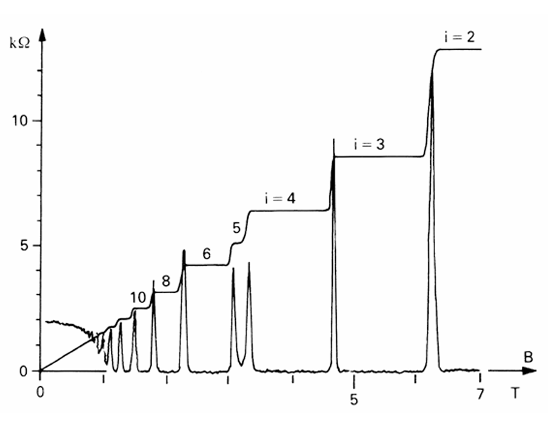
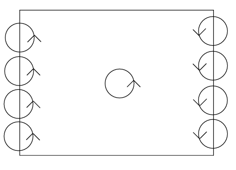
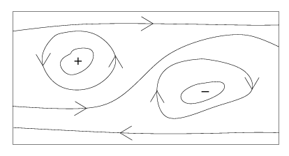
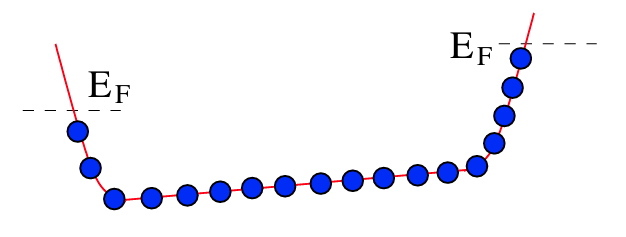
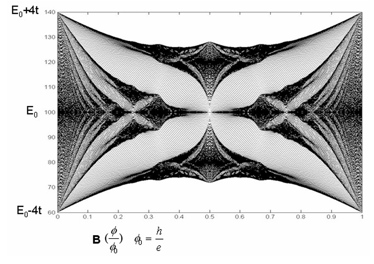

# Integer Quantum Hall Effect

*Oct.25 2024*

## Experiment

- i stands for ν, the pleateau curve is $ρ_{xy}=\frac{E_x}{J_y}$, the spikes curve is $σ_{xx}=\frac{I_x}{J_x}$
- $ν ∈ ℤ$ an integer labeling the pleateaus
- hall resistivity $ρ_{xy} = \frac{E_x}{J_y}$ pleateaus at

    - $ρ_{xy} = \frac{2πħ}{e^2} \frac{1}{ν} = \frac{Φ_0}{eν}$
    - pleateau center: $B=\frac{n}{ν} Φ_0, Φ_0 = \frac{2πħ}{e}$
        - $n$ electron density
- longitudal resitivity $ρ_{xx} = \frac{E_x}{J_x}$ spikes at jumping between pleateaus
- the "dirty" of real life physics system is an essential ingredient

    - more impurities the sample have, more prominent plateaux you got
- Real Material

    - Si MOSFET (metal-oxide-semiconductor field-effect transistor)
        - metal(gate)-insulator(oxide)-semiconductor sandwich
    - electrons trapped in the inversion band of width ~30Å at the interface between insulator and semi conductor
    - density of electrons $n∼10^{11} - 10^{12} cm^{-2}$

## General Picture

- Each free electron contributes a current $eE/B$
    - $J=neE/B$ (Classical Hall Effect)
- On the energy landscape, the electrons are organized into Landau Levels
    - Each Landau Level have degeneracy density $n_n=B/Φ_0$. ($Φ_0=h/e$)
- Background potential redistributed the current contribution for orbits inside every Landau Level
    - The total current of each Landau Level remains unchanged under such perturbation $J_n=eE/Φ_0$
- For half-filling Landau levels, electrons might fill the localized orbits which do not contribute to Hall conductivity
    - **Plateaux** When decreasing B, the increase of average current for conducting electrons is canceled by the decrease of the capacity of the conducting bands, and excessive electrons are absorbed by the localized valence bands, so the total current remains unchanged
        - $J=νeE/Φ_0$ (Integer Hall Effect)
    - **Hops and Spikes** During Hops, the electrons start filling half-filling conductivity band, resulting in spikes in transverse conductivity
    - **Unevenness interval between Hops** It is because of the unpredictbility of conduction band width and propotion in each Landau Level.
    - **interval between middle positions** It corresponds to fully-filled landau levels, and can be predicted.
- What we need to show
    - localization of Landau levels
    - the hall conductivity counts the number of bands, instead of the carrier density in each band
    - change of band structure under the magnetic field

# Semiclassical Picture of Integer Hall Effect

## Impurity Localizes the Landau Levels

- Edge modes on boundary
    - 
    - electron cyclones counterclockwise (negative charge)
    - when bouncing on boundary, they form a clockwise flow
    - turning on electric field ⟹ every cyclone got a drift velocity ⟹ net current
- Dirty Material ⟹ localised orbits
    - 
    - Semiclassical picture: left-hand-maze-navigation on equipotential lines
        - states with higher-than-average energy is localized around the local maximums in CCW motion
        - states with lower-than-average energy is localized around the local minimum in CW motion
    - states at the middle ground might be able to navigate through the whole system
- Energy Spectrum
    - 
    - a few localised states sandwitched by the "valence-bands"

## Landau levels in a Potential Well

- The model
    - Landau Gauge preserves the translational symmetry in y, and its eigenfunctions are localized in x
    - 
    - boundary of the material ⟹ a potential well
    - E field ⟹ tilt
    - Landau gauge ⟹ localized $x$ for each orbit
    - At equiliburium, the Fermi Energy at the two x ends of the system are differed by the Hall Potential $V_H$
- Drift velocity = Slope of local Potential
    - drift velocity $v_y = \frac{1}{(-e)B} ∂_x U, U=(-e)V$
        - quantum mechanically valid if the curvature of the potential is small
- Net current = ∑ Drift velocity = Δ Fermi Energy
    - $J_y = (-e)∫\frac{dk}{2π}v_y(k) = \frac{(-e)}{2πħ}∫dx\frac{∂U}{∂x} = \frac{e^2}{2πħ}V_H$
        - $v_y = \frac{1}{(-e)B} \partial_x U,  ΔU=(-e)V_H$
        - $dk/dx=-1/l_B^2, l_B=\sqrt{ħ/eB}$
- The total derivative indicates Hall Current is a topological invariant, robust against perturbation of basin shape
    - 
    - Each Fully Filled Landau Level contributes $e^2/2πħ$
    - hence, the hall conductivity counts the number of bands, instead of the carrier density in each band

# Kubo Formula and Chern Number

## General Picture

- **Berry Curvature:** contribution to Hall conductivity of a state is equivalent to the Berry Curvature w.r.t. momentum space
- **Brillouin Zone:** atomic lattice breaks the momentum space into Brillouin Zones / Energy Bands
- **Chern Number:** Integrating the Berry Curvature in a certain Brillouin Zone gives an integer called Chern Number.
- Thus the Hall conductivity takes integer value
    - $σ_{xy}=\frac{-e}{Φ_0} C$

## Kubo Formula

- Hall Conductivity is the linear response of Current Operators
    - $σ_{xy}(w) = \frac{1}{ħω}∫_{-∞}^0 dt e^{-iωt} ⟨0|[J_x(t), J_y(0)]|0⟩$
        - $J=\frac{δL}{δA}=-\frac{δH}{δA}$ is the coupling current
        - pole selection: $ω→ω+iϵ$
        - $A_x=E_x/iω e^{-iωt}$ induces $J_y$
        - It is just Newton's third law: Response pushes back in the same way the drive is coupled
    - derived from the linear order perturbation of interaction picture
        - $J(0)=U^{-1}J(-∞)U, U(-∞,0)=Te^{-\frac{i}{ħ}∫_{-∞}^0 Δ(H)(t) dt}$
- Kubo Formula
    - $σ_{xy}(ω→0) = iħ ∑\limits_{n≠0}\frac{⟨0|J_y|n⟩⟨n|J_x|0⟩-(J_x↔J_y)}{(E_n-E_0)^2}$

## TKNN Formular

- The hall conductivity of a occupied state is the linear response of probe field A. The perturbation is contributed from all the unoccupied states
    - $σ_{xy} = iħ ∑\limits_{α,k;β,k'} \frac{⟨u_{α,k}|J̃_y|u_{β,k'}⟩⟨u_{β,k'}|J̃_x|u_{α,k}⟩ - x↔y}{(E_{β,k'} - E_{α,k})^2}$
        - $α$, $k$ labels the filled states, they sum up into the conductivity
        - $β$, $k'$ labels the empty states, they perturbs the energy and the wavefunction of the filled states
        - $∑_k$ stands for $∫_{T^2}\frac{dk^2}{(2π)^2}$, where $T^2$ is the Brillouin Zone
- current can be inferred from the group velocity
    - $J̃_i = (-e) \frac{1}{ħ} \frac{∂H̃}{∂k_i}$
- $⟨u_{α,k}|∂_{k_i} H̃ |u_{β,k'}⟩$
    - $= ∂_{k_i}(⟨u_{α,k}| H̃) |u_{β,k'}⟩ - ∂_{k_i}(⟨u_{α,k}|) H̃ |u_{β,k'}⟩$
    - $= (E_α-E_β)⟨∂_{k_i} u_{α,k}|u_{β,k'}⟩$
- $∑_{β,k'} |u_{β,k'}⟩⟨u_{β,k'}| ∼ 𝟙$
    - the perturbation is antisymmetric under switching two states
    - when $β,k'$ is summed over the filled bands $α,k$ is summed over, the contribution is 0
- The hall conductivity of each band can be written as the Chern Number over the Brillouin Zone
    - $σ_{xy,α} = \frac{ie^2}{ħ} ∫_{T^2}\frac{dk^2}{(2π)^2}⟨∂_{k_y} u_{α,k}|∂_{k_x} u_{α,k}⟩ - x↔y$
        - $=-\frac{ie^2}{2πħ}C$
            - $C = \frac{1}{2π}∬F_{ij}dS^{ij}$
            - $F_{ij} = ⟨∂_{k_i} u_{α,j}|∂_{k_j} u_{α,i}⟩ - i↔j$

## Example

- $H̃(k) = \sin k_x σ_1 + \sin k_y σ_2 + (m+\cos k_x + \cos k_y) σ_3$
    - 2-component Dirac fermion in 2+1d
    - "Dirac-Chern insulator"
    - $C = \frac{1}{2π}∬d^2k⟨∂_{k_x} u_{α,y}|∂_{k_y} u_{α,x}⟩ - x↔y$
        - $=\begin{cases}-1 & -2<m<0 \\1 & 0<m<2 \\0 & |m|>2 \end{cases}$

## Supplemental: Legendre Tranformation of Coupling Term

- $\frac{δH(x,p;A)}{δA}=-\frac{δL(x,v;A)}{δA}$
    - $L = L(x,v;A)$
    - $\frac{∂H(x,p;A)}{∂A} = \frac{∂}{∂A}|_{x,p}(p v(x,p;A) -L(x,v(x,p;A);A)$
        - $= p \frac{v(x,p;A)}{∂A} - \frac{∂L(x,v;A)}{∂A} - \frac{∂L(x,v;A)}{∂v}\frac{v(x,p;A)}{∂A}$
        - $= - \frac{∂L(x,v;A)}{∂A}$
    - when x,p are fixed, the variation of v(x,p;J) is canceled in $H=pv-L$

## Supplemental: Brillouin Zone

- For a rectangular lattice of cell size (a,b)
- Block function $u_k(x)$
    - $ψ_k = e^{i\vec k⋅\vec x}u_k(x)$
    - periodic in (a,b)
    - eigenfunction of $H̃ = e^{-ikx} H e^{ikx}$
- Brillouin Zone $-\frac{π}{a} ≤ k_x ≤ \frac{π}{a}, -\frac{π}{b} ≤ k_y ≤ \frac{π}{b}$
    - changing $k_x$ by $2π/a$ is equivalent to changing $u_k$ by $e^{2π x/a}$
    - states at the two ends are identified to each other in each Brillouin Zone

## Supplemental: Berry Curvature and Chern Number

- Given a parameter space $λ^i$
    - Hamiltonian $H(λ^i)$
        - assumes non-degeneracy
    - eigenstates $|n(λ^i)⟩$ changes smoothly w.r.t. λ
        - guaranteed by the adiabatic theorem
        - there is a phase ambuiguity
    - adiabatic evolution: $⟨ψ|\dot ψ⟩=0$
        - $|ψ⟩=U|n⟩$
        - $U(t) = e^{-∫⟨n|ṅ⟩dt}=e^{∫iA_i \frac{dλ^i}{dt} dt}$
- Berry Connection
    - Berry Connection $i A_i = -⟨n|∂_i|n⟩$
        - $D=∂-iA$
    - Berry Curvature 
        - $F_{ij} = ∂_i A_j - ∂_j A_i -i[A_i,A_j]= i[D_i, D_j]$
            - $= i (⟨∂_i n|∂_j n⟩ - ⟨∂_j n|∂_i n⟩)$
    - the phase change of an adiabatic loop $𝒞$
        - $e^{iγ} = \exp(i∮_𝒞 A_i(λ)dλ^i) = \exp(i∬_S F_{ij}dS^{ij})$
        - S is an arbitrary surface whose boundary is 𝒞.
- On a 2D manifold, the integral of Berry Curvature gives the Chern Number
    - $∬F_{ij}dS^{ij} = 2πC$
- On a closed manifold, Chern number should be an integer
    - argument:
        - the phase shift $γ$ of an adiabatic loop $𝒞$, modulus $2π$, is a physical observable, and only depends on the local property along that loop
        - so, the computation of $γ$ should be consistent, using whatever gauge convention $A_i$, and under whatever 2D manifold $S$, as long as $∂S=𝒞$
        - consider an infinitisemal disk $D$, the phase shift around $∂D$ is zero. The phase shift calculated by integrating the remaining of the manifold should be multiple of $2π$, which is the Chern number.
- "the Chern number of a complex line bundle over the parameter manifold"
    - "complex line" = quantum state modulus complex phase
    - "bundle": lines on different parameter points glue into a whole by adiabatic evolution
        - a mapping from the parameter space to the Hilbert Space modulus complex phase
    - "Chern number" counts the topological property of the manifold, and can be added up from different patches. thus discritized as an integer

## Supplemental: Parallel Transport
- we are using the pullback convention
- Covariant Derivative $D=∂ - iA$
    - gauge covariant: $ψ↦e^{iβ}ψ, A↦A+∂β$
        - $D(A^{(β)})e^{iβ} = e^{iβ}D(A)$
- Pullback vs Pushforward
    - when doing partial derivative, we compare the object A at (x+δx) with B at (x) by pullback A from (x+δx) to x using the naive connection $∂$.
        - the phase disagrement, introduced by the naive connection, compared to the parallel connection, is $∂-D = iA$
    - in willson loop, we instead pushing forward an object A from (x) to (x+δx) using parallel connection. 
        - the phase caused by parallel transport $-D$, compared to the reference object B transported by the naive connection ($-∂$), is $(-D) - (-∂) = iA$
    - in gauge transformation $ψ↦e^{iβ}ψ$, $∂$ is subject to such rotation, but $D$ is not
        - $iΔA=Δ∂-ΔD=i∂β$
- Recap 
    - the gauge field $iA=∂_{(A)}-D$ measures the additional phase introduced by the pullback of the gauge-dependent naive connection $∂_{(A)}$
        - $i$ means it is considered a phase
    - it is also the additional phase caused by pushing forward an object, compared to the reference state pushed forward by naive connection $-∂_{(A)}$

- Wilson Loop $iγ=P∮iA(λ)⋅dλ$
    - the total phase change by pushing forward a object along a closed circle 
    - P path ordering for nonabelian A
- Parallel transport equation
    - along the trajectory $\dot λ⋅D |ψ(λ)⟩=\dot λ⋅(∂-iA) |ψ(λ)⟩$
    - $\frac{d}{dt}|ψ(λ(t))⟩ = \dot λ ⋅ ∂|ψ⟩ = \dot λ ⋅ iA |ψ⟩$

## Supplemental: Perturbation Theory

- Quantum Perturbation Theory
    - $|ψ⟩' = |ψ⟩ + ∑\limits_{n≠ψ} \frac{⟨n|ΔH|ψ⟩}{E_n - E_ψ} |n⟩$
    - $E' = E + ⟨ψ|ΔH|ψ⟩ + ∑\limits_{n≠ψ}\frac{|⟨n|ΔH|ψ⟩|^2}{E_n-E_ψ}$

# Lattice Model with Magnetic Field
## General Picture
- the magnetical flux across the lattice cell should be an integer multiple of the flux quanta:  
    - $\frac{B L_x L_y}{Φ_0} ∈ ℤ, Φ_0 = 2πħ/e, $
- when the magnetic field is tuned such that the flux in each cell is a rational multiple of the flux quanta $Φ=\frac{p}{q} Φ_0$:
    - the lattice translational symmetry further breaks into supercells $q$-fold larger, ensuring the flux in each supercell is an integer multiple of flux quanta
    - the Brillouin Zone shrinks $q$-fold. 
    - each band was split into $q$ bands
- when $p/q$ is irrational, there is a fractal behavior
## Hamiltonian
- Hamiltonian
    - on lattice, $T_i = ∑|x⟩e^{-i \frac{e}{ħ} A_i }⟨x+e_i|$

## Dirac Quantization Condition
- Dirac Quantization Condition
    - on a Brillouin Zone of size $2π/L_x,2π/L_y$
    - there are two ways of returning to the origin
        - $T_y T_x$: loop along x, then loop along y
        - $T_x T_y$: loop along y, then loop along x
            - $T_i = e^{D_i} = \exp(∂_i-i \frac{e}{ħ} A_i)$ pulls back state by $∂_i$
        - they are the same loop with different starting point, and thus should give the same phase shift
        - however, they are connected by a continuous deformation that scanns over the Brillouin Zone, resulting in a disagreement of the phase shift
            - $T_y T_x = e^{-ieBL_xL_y/ħ} T_x T_y $
        - $eBL_xL_y/ħ$ should be multiple of 2π
## Hofstadter Butterfly
- Harper Equation
    - $2 \cos(k_1 a + \frac{p}{q} 2πr)\tilde ψ_r(k) + e^{ik_2a}\tilde ψ_{r+1}(k) + e^{-ik_2 a} \tilde ψ_{r-1}(k) = -\frac{E(k)}{t} \tilde ψ_r(k)$
- Numerical Solution for nonrational flux
    - 

## Integer Hall Effect of the lattice model
- consider rational case $Φ=\frac{p}{q}Φ_0$
- for the $r$th of the $q$ bands
- integer solution for linear Diophantine equation
    - $r = q s_r + p t_r, |t_r|≤q/2$
- Chern Number
    - $C_r = t_r - t_{r-1}$
        - $t_0=0$
- if the first $r$ bands are filled
    - $σ_{xy} = \frac{e^2}{2πħ} t_r$
- Examples
    - $Φ=pΦ_0$: single band, $σ_xy$ vanishes
    - $p/q=11/7$: 
        - $(s_r,t_r) = $(-3,2), (5,-3), (2,-1), (-1,1), (-4,3), (4,-2), (1,0)
    - the Hall Conductivity varies between negative and positive by the sequence
        - 2, -3, -1, 1, 3, -2, 0
    