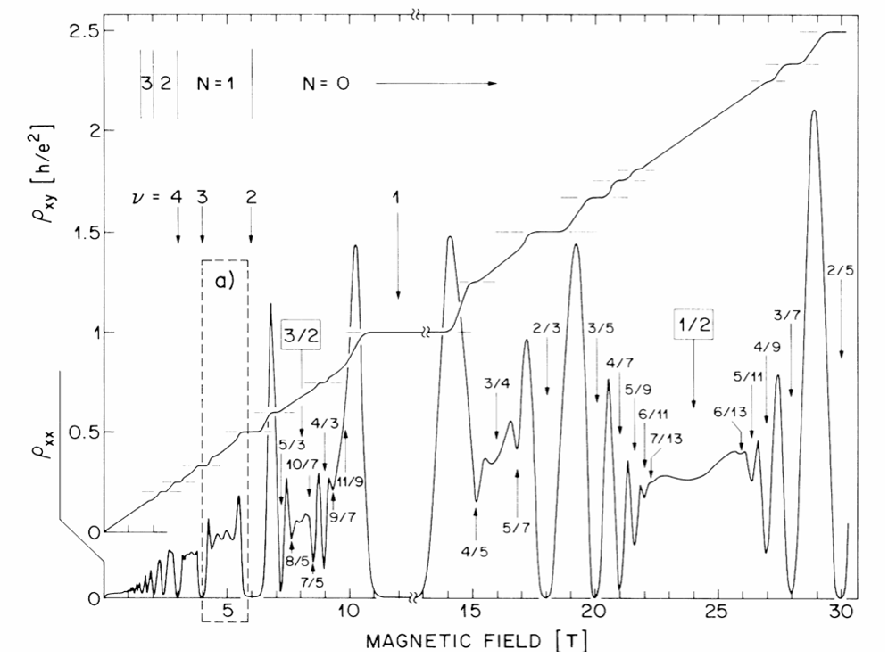

# Notes on Fractional Quantum Hall Effect

### References

[The Quantum Hall Effect by David Tong](https://www.damtp.cam.ac.uk/user/tong/qhe/qhe.pdf)

# Quantum Mechanics of Classical Hall Effect

*Oct.23 2024*

## Landau Levels

### Lagrangian

- let's consider a 2d system, where particle of charge -e moves in xy plane, and magnetical field is towards z direction $B=(0,0,B_z)$.
    - $L = \frac12 m ẋ^2 - e ẋ ⋅ A$
    - $p=mẋ - e A$
    - $H = p ẋ - L = \frac{1}{2m}(p + e A)^2 = \frac12 m ẋ^2$

### Gauge Transformation
- $A_i ∼ A_i + ∂_iχ, L → L - e \dot χ$
    - preserves $B = ∇×A$
- Gauge Choices:
    - Landau Gauge: $A=(0,xB)$
    - Symmetric Gauge: $A=(-\frac12 yB, \frac12 xB)$

### canonical vs mechanical momentum

- canonical momentum $p=\frac{∂L}{∂ẋ}=mẋ-eA$
    - detects the wavenumber
        - $p = -iħ∂$
    - not gauge invariant, depends on the phase convention
    - canonical
        - $[x_i,p_j]=iħδ_{ij}, [x_i,x_j]=0, [p_i,p_j]=0$
- mechanical momentum $π = p + eA = mẋ$
    - gauge invariant derivative, akin to "covariant derivative" in GR
        - $D = \frac{i}{ħ}π = ∂ + i\frac{e}{ħ}A$
    - gauge independent, have physics meaning
    - not canonical, have non-vanishing poisson bracket
        - $[π_x,π_y]=-ieħB_z$
- "conjugate" momentumn $\tilde π= p - eA$ (symmetric gauge)
    - gauge depedent. this form is defined under symmetric gauge
    - commutes with $π$
        - $[π_i,\tilde π_j] = 0$
    

### Ladder operators and the Spectrum

- $[a,a^†]=1$ raises landau level
    - $α = \frac{1}{\sqrt{2eħB}}(π_x - iπ_y)$
    - $α^† = \frac{1}{\sqrt{2eħB}}(π_x + iπ_y)$
- $[b,b^†]=1$ provides degeneracy in each landau level (symmetric gauge)
    - $b = \frac{1}{\sqrt{2eħB}}(\tilde π_x + i \tilde π_y)$
    - $b^† = \frac{1}{\sqrt{2eħB}}(\tilde π_x - i \tilde π_y)$
- $H=ħω_B(α^†α+\frac12), [a,a^†]=1$
    - $|n,m⟩ = \frac{a^{†n}b^{†m}}{\sqrt{n!m!}}|0,0⟩$
- cyclotron freq $ω_B=eB/m$
    - the angular speed of a classical electron in a magnetic field

### Lowest Landau Levels in Symmetric gauge

- ladder operator as differential equation
    - $α = -i\sqrt2(l_b\bar ∂ + \frac{z}{4l_B})$
    - $b = -i\sqrt2(l_b\bar ∂ + \frac{z̄}{4l_B})$
    - $b^† = -i\sqrt2(l_b\bar ∂ - \frac{z̄}{4l_B})$
- starting from the state annihilated by α and b:
    - $ψ_{LLL,m=0}(z,z̄) ∝ e^{-|z|^2/4l_B^2}$
- acting $b^†$ pulls down a factor of $z/2l_B$
    - $ψ_{LLL,m}(z,z̄) ∝ (\frac{z}{l_B})^m e^{-|z|^2/4l_B^2}$
- it is also the angular momentum eigenstate
    - $J = ħ(z∂ - z̄\bar ∂)$
    - $Jψ_{LLL,m} = ħm ψ_{LLL_m}$

### Orbitals in Landau gauge

- landau gauge

    - $A = (0, xB)$
    - Motivation: later we will introduce Electric field in x direction. This gauge breaks the translational symmetry in x direction, but keeps it in the y direction
- hamoiltonian under landau gauge

    - $H_k=\frac{1}{2m} p_x^2 + \frac12 m ω_B^2 (x + p_y l_B^2)^2$
        - magnetic length $l_B = \sqrt{ħ/eB}$
            - 1 Tesla = 250 Å
- eigenstate

    - $ψ_{n,k_y} ∝ e^{ik_y y} H_n(x) e^{-x^2/2l_B^2}$
        - $H_m$ Hermite polynomial wavefunctions for harmonic oscillator
- localization in x

    - In Landau gauge, the orbits are stripes extended in y direction but exponentially localized around $x=-k_y l_B^2$
    - The x coordinate determines the y momentum $k_y=-x/l_B^2$
- there is a marcoscopic number of degeneracy on each landau level

    - all the orbits on the same Landau Level $n$ have the same energy
    - $E_n = ħω_B (n+\frac12)$
        - cyclotron freq $ω_B=eB/m$

### Number of Degeneracy of a Landau levels

- Estimate number of degeneracy at each Landau level
    - $N = \frac{L_y}{2π}∫_{-L_x/l_B^2}^0 dk_y = \frac{L_xL_y}{2πl_B^2}$
        - $L_y/2\pi$ is the spacing of discritized $k_y$ modes
        - the range of $k_y$ is determined by the range of $x_0$
        - magnetic length $l_B = \sqrt{ħ/eB}$
            - 1 Tesla = 250 Å
- The degeneracy of Landau level equals the magnetic flux counted in $Φ_0$
    - $N=\frac{AB}{Φ_0}$
    - Quantum of Flux $Φ_0 = \frac{2πħ}{e}$
        - the "quanta" of magnetic flux
- large degeracy of landau levels means you can linear combine those stripes to almost any shape you like

## Hall Effect of Free Electron

### E × B drift of cyclones

- the "instant center" of the circular motion as quantum operators
    - $X=x-\frac{π_y}{mω_B}, Y=y+\frac{π_x}{mω_B}$
    - $[H,X]=[H,Y]=0, [X,Y]=il_B^2$
- equation of motion
    - $iħẊ = [X,H+V] = i l_B^2 ∂_y V$
    - $iħẎ = [X,H+V] = -i l_B^2 ∂_x V$
- moves along the left-handed-wall of equipotential
    - $(Ẋ,Ẏ) ∝ E×B$
    - applies for both positive and negative charged particles
        - flip e, v dont flip, I flip

### Classical Hall Effect

- Adding an Electric field along +x
- Landau levels under E field
    - $H = \frac{1}{2m}(p_x^2 + (p_y+eBx)^2) + eEx$
    - Displace the oscillator center $x_0$ by $-mE/eB^2$
        - $ψ_E(x,y) = ψ_{n,k_y}(x+mE/eB^2,y)$
    - Energy shift
        - $ΔE_{n,k_y} = eE (-k_y l_B^2 - \frac{eE}{mω_B^2}) + \frac{mE^2}{2B^2}$
            - first term: electric potential at $x_0 = -k_y l_B^2 - \frac{eE}{mω_B^2}$
            - second term: kinematic energy of the cyclone motion
    - Group Velocity
        - $v_g = \frac{∂E_{n,k_y}}{∂ħk_y} = - \frac{E}{B}$
- Hall Current
    - $J = - nev$
    - average velocity: $v̄_y = -E_x/B_z$
        - $v̄ = ⟨ẋ⟩ = \frac{1}{m}  ⟨ψ_{n,k}|-iħ∂+eA|ψ⟩$
        - $v̄_y = \frac{1}{m} ⟨ψ_{n,k}|ħk + eBx|ψ⟩$
        - $⟨x⟩ = x_0 = -\frac{ħk}{eB} - \frac{mE}{eB^2}$
    - number of electrons at each landau level : $n = \frac{B}{Φ_0}$
    - assume $ν$ bands are being fully filled
    - $J_y = eνE/Φ_0$
    - $ρ_{xy} = \frac{E_x}{I_y} = \frac{Φ_0}{eν}$

## Supplemental: the minus sign in electron charge

- charge of electron $q=-e$
- minimal coupling: $ΔL = q ẋ A$
- canonical momentum: $p = ħk = -iħ∂ = mẋ + qA$
    - mechanic velocity: $ẋ = (p-qA)/m$
    - covariant derivative: $D = \frac{i}{ħ}(p-qA) = ∂ - i \frac{q}{ħ}A$
        - $F_{ij}=∂_i A_j - ∂_j A_i = \frac{iħ}{q}[D_i,D_j]$
- magnetic length, flux quanta: $l_B=\sqrt{\frac{ħ}{|q|B}}, Φ_0 = \frac{2πħ}{|q|}$
    - do not take the minus sign
    - $q$ is to the power of 2 in the expression of hall conductivity, but the conductivity follows the sign of $q$.

## Supplemental: Complex Coordinate (-y)

- note here we use unusual convention $z=x-iy$
- Complex coordinate
    - $z=x-iy, z̄=x+iy$
    - $∂=\frac12(∂_x+i∂_y), \bar ∂=\frac12(∂_x-i∂_y)$
- Angular Momentum operator
    - $J = iħ(x∂_y - y∂_x) = ħ(z∂ - z̄\bar ∂)$

## Supplemental: Clarification on Zeeman Splitting

- The interaction of electron spin in Magnetic Field
- Landau spitting $ΔE=ħeB/m_\text{effective}$
- Zeeman splitting $ΔE=ħgeB/2m_\text{electron}$
    - g ~ 2, vary due to band structure
    - m_effective is much smaller
    - Zeeman splitting is much smaller (e.g. 70x) than Landau Splitting

# Integer Quantum Hall Effect

*Oct.25 2024*

## Experiment

- i stands for ν, the pleateau curve is $ρ_{xy}=\frac{E_x}{J_y}$, the spikes curve is $σ_{xx}=\frac{I_x}{J_x}$
- $ν ∈ ℤ$ an integer labeling the pleateaus
- hall resistivity $ρ_{xy} = \frac{E_x}{J_y}$ pleateaus at

    - $ρ_{xy} = \frac{2πħ}{e^2} \frac{1}{ν} = \frac{Φ_0}{eν}$
    - pleateau center: $B=\frac{n}{ν} Φ_0, Φ_0 = \frac{2πħ}{e}$
        - $n$ electron density
- longitudal resitivity $ρ_{xx} = \frac{E_x}{J_x}$ spikes at jumping between pleateaus
- the "dirty" of real life physics system is an essential ingredient

    - more impurities the sample have, more prominent plateaux you got
- Real Material

    - Si MOSFET (metal-oxide-semiconductor field-effect transistor)
        - metal(gate)-insulator(oxide)-semiconductor sandwich
    - electrons trapped in the inversion band of width ~30Å at the interface between insulator and semi conductor
    - density of electrons $n∼10^{11} - 10^{12} cm^{-2}$

## General Picture

- Each free electron contributes a current $eE/B$
    - $J=neE/B$ (Classical Hall Effect)
- On the energy landscape, the electrons are organized into Landau Levels
    - Each Landau Level have degeneracy density $n_n=B/Φ_0$. ($Φ_0=h/e$)
- Background potential redistributed the current contribution for orbits inside every Landau Level
    - The total current of each Landau Level remains unchanged under such perturbation $J_n=eE/Φ_0$
- For half-filling Landau levels, electrons might fill the localized orbits which do not contribute to Hall conductivity
    - **Plateaux** When decreasing B, the increase of average current for conducting electrons is canceled by the decrease of the capacity of the conducting bands, and excessive electrons are absorbed by the localized valence bands, so the total current remains unchanged
        - $J=νeE/Φ_0$ (Integer Hall Effect)
    - **Hops and Spikes** During Hops, the electrons start filling half-filling conductivity band, resulting in spikes in transverse conductivity
    - **Unevenness interval between Hops** It is because of the unpredictbility of conduction band width and propotion in each Landau Level.
    - **interval between middle positions** It corresponds to fully-filled landau levels, and can be predicted.
- What we need to show
    - localization of Landau levels
    - the hall conductivity counts the number of bands, instead of the carrier density in each band
    - change of band structure under the magnetic field

# Semiclassical Picture of Integer Hall Effect

## Impurity Localizes the Landau Levels

- Edge modes on boundary
    - 
    - electron cyclones counterclockwise (negative charge)
    - when bouncing on boundary, they form a clockwise flow
    - turning on electric field ⟹ every cyclone got a drift velocity ⟹ net current
- Dirty Material ⟹ localised orbits
    - 
    - Semiclassical picture: left-hand-maze-navigation on equipotential lines
        - states with higher-than-average energy is localized around the local maximums in CCW motion
        - states with lower-than-average energy is localized around the local minimum in CW motion
    - states at the middle ground might be able to navigate through the whole system
- Energy Spectrum
    - 
    - a few localised states sandwitched by the "valence-bands"

## Landau levels in a Potential Well

- The model
    - Landau Gauge preserves the translational symmetry in y, and its eigenfunctions are localized in x
    - 
    - boundary of the material ⟹ a potential well
    - E field ⟹ tilt
    - Landau gauge ⟹ localized $x$ for each orbit
    - At equiliburium, the Fermi Energy at the two x ends of the system are differed by the Hall Potential $V_H$
- Drift velocity = Slope of local Potential
    - drift velocity $v_y = \frac{1}{(-e)B} ∂_x U, U=(-e)V$
        - quantum mechanically valid if the curvature of the potential is small
- Net current = ∑ Drift velocity = Δ Fermi Energy
    - $J_y = (-e)∫\frac{dk}{2π}v_y(k) = \frac{(-e)}{2πħ}∫dx\frac{∂U}{∂x} = \frac{e^2}{2πħ}V_H$
        - $v_y = \frac{1}{(-e)B} \partial_x U,  ΔU=(-e)V_H$
        - $dk/dx=-1/l_B^2, l_B=\sqrt{ħ/eB}$
- The total derivative indicates Hall Current is a topological invariant, robust against perturbation of basin shape
    - 
    - Each Fully Filled Landau Level contributes $e^2/2πħ$
    - hence, the hall conductivity counts the number of bands, instead of the carrier density in each band

# Kubo Formula and Chern Number

## General Picture

- **Berry Curvature:** contribution to Hall conductivity of a state is equivalent to the Berry Curvature w.r.t. momentum space
- **Brillouin Zone:** atomic lattice breaks the momentum space into Brillouin Zones / Energy Bands
- **Chern Number:** Integrating the Berry Curvature in a certain Brillouin Zone gives an integer called Chern Number.
- Thus the Hall conductivity takes integer value
    - $σ_{xy}=\frac{-e}{Φ_0} C$

## Kubo Formula

- Hall Conductivity is the linear response of Current Operators
    - $σ_{xy}(w) = \frac{1}{ħω}∫_{-∞}^0 dt e^{-iωt} ⟨0|[J_x(t), J_y(0)]|0⟩$
        - $J=\frac{δL}{δA}=-\frac{δH}{δA}$ is the coupling current
        - pole selection: $ω→ω+iϵ$
        - $A_x=E_x/iω e^{-iωt}$ induces $J_y$
        - It is just Newton's third law: Response pushes back in the same way the drive is coupled
    - derived from the linear order perturbation of interaction picture
        - $J(0)=U^{-1}J(-∞)U, U(-∞,0)=Te^{-\frac{i}{ħ}∫_{-∞}^0 Δ(H)(t) dt}$
- Kubo Formula
    - $σ_{xy}(ω→0) = iħ ∑\limits_{n≠0}\frac{⟨0|J_y|n⟩⟨n|J_x|0⟩-(J_x↔J_y)}{(E_n-E_0)^2}$

## TKNN Formular

- The hall conductivity of a occupied state is the linear response of probe field A. The perturbation is contributed from all the unoccupied states
    - $σ_{xy} = iħ ∑\limits_{α,k;β,k'} \frac{⟨u_{α,k}|J̃_y|u_{β,k'}⟩⟨u_{β,k'}|J̃_x|u_{α,k}⟩ - x↔y}{(E_{β,k'} - E_{α,k})^2}$
        - $α$, $k$ labels the filled states, they sum up into the conductivity
        - $β$, $k'$ labels the empty states, they perturbs the energy and the wavefunction of the filled states
        - $∑_k$ stands for $∫_{T^2}\frac{dk^2}{(2π)^2}$, where $T^2$ is the Brillouin Zone
- current can be inferred from the group velocity
    - $J̃_i = (-e) \frac{1}{ħ} \frac{∂H̃}{∂k_i}$
- $⟨u_{α,k}|∂_{k_i} H̃ |u_{β,k'}⟩$
    - $= ∂_{k_i}(⟨u_{α,k}| H̃) |u_{β,k'}⟩ - ∂_{k_i}(⟨u_{α,k}|) H̃ |u_{β,k'}⟩$
    - $= (E_α-E_β)⟨∂_{k_i} u_{α,k}|u_{β,k'}⟩$
- $∑_{β,k'} |u_{β,k'}⟩⟨u_{β,k'}| ∼ 𝟙$
    - the perturbation is antisymmetric under switching two states
    - when $β,k'$ is summed over the filled bands $α,k$ is summed over, the contribution is 0
- The hall conductivity of each band can be written as the Chern Number over the Brillouin Zone
    - $σ_{xy,α} = \frac{ie^2}{ħ} ∫_{T^2}\frac{dk^2}{(2π)^2}⟨∂_{k_y} u_{α,k}|∂_{k_x} u_{α,k}⟩ - x↔y$
        - $=-\frac{ie^2}{2πħ}C$
            - $C = \frac{1}{2π}∬F_{ij}dS^{ij}$
            - $F_{ij} = ⟨∂_{k_i} u_{α,j}|∂_{k_j} u_{α,i}⟩ - i↔j$

## Example

- $H̃(k) = \sin k_x σ_1 + \sin k_y σ_2 + (m+\cos k_x + \cos k_y) σ_3$
    - 2-component Dirac fermion in 2+1d
    - "Dirac-Chern insulator"
    - $C = \frac{1}{2π}∬d^2k⟨∂_{k_x} u_{α,y}|∂_{k_y} u_{α,x}⟩ - x↔y$
        - $=\begin{cases}-1 & -2<m<0 \\1 & 0<m<2 \\0 & |m|>2 \end{cases}$

## Supplemental: Legendre Tranformation of Coupling Term

- $\frac{δH(x,p;A)}{δA}=-\frac{δL(x,v;A)}{δA}$
    - $L = L(x,v;A)$
    - $\frac{∂H(x,p;A)}{∂A} = \frac{∂}{∂A}|_{x,p}(p v(x,p;A) -L(x,v(x,p;A);A)$
        - $= p \frac{v(x,p;A)}{∂A} - \frac{∂L(x,v;A)}{∂A} - \frac{∂L(x,v;A)}{∂v}\frac{v(x,p;A)}{∂A}$
        - $= - \frac{∂L(x,v;A)}{∂A}$
    - when x,p are fixed, the variation of v(x,p;J) is canceled in $H=pv-L$

## Supplemental: Brillouin Zone

- For a rectangular lattice of cell size (a,b)
- Block function $u_k(x)$
    - $ψ_k = e^{i\vec k⋅\vec x}u_k(x)$
    - periodic in (a,b)
    - eigenfunction of $H̃ = e^{-ikx} H e^{ikx}$
- Brillouin Zone $-\frac{π}{a} ≤ k_x ≤ \frac{π}{a}, -\frac{π}{b} ≤ k_y ≤ \frac{π}{b}$
    - changing $k_x$ by $2π/a$ is equivalent to changing $u_k$ by $e^{2π x/a}$
    - states at the two ends are identified to each other in each Brillouin Zone

## Supplemental: Berry Curvature and Chern Number

- Given a parameter space $λ^i$
    - Hamiltonian $H(λ^i)$
        - assumes non-degeneracy
    - eigenstates $|n(λ^i)⟩$ changes smoothly w.r.t. λ
        - guaranteed by the adiabatic theorem
        - there is a phase ambuiguity
    - adiabatic evolution: $⟨ψ|\dot ψ⟩=0$
        - $|ψ⟩=U|n⟩$
        - $U(t) = e^{-∫⟨n|ṅ⟩dt}=e^{∫iA_i \frac{dλ^i}{dt} dt}$
- Berry Connection
    - Berry Connection $i A_i = -⟨n|∂_i|n⟩$
        - $D=∂-iA$
    - Berry Curvature 
        - $F_{ij} = ∂_i A_j - ∂_j A_i -i[A_i,A_j]= i[D_i, D_j]$
            - $= i (⟨∂_i n|∂_j n⟩ - ⟨∂_j n|∂_i n⟩)$
    - the phase change of an adiabatic loop $𝒞$
        - $e^{iγ} = \exp(i∮_𝒞 A_i(λ)dλ^i) = \exp(i∬_S F_{ij}dS^{ij})$
        - S is an arbitrary surface whose boundary is 𝒞.
- On a 2D manifold, the integral of Berry Curvature gives the Chern Number
    - $∬F_{ij}dS^{ij} = 2πC$
- On a closed manifold, Chern number should be an integer
    - argument:
        - the phase shift $γ$ of an adiabatic loop $𝒞$, modulus $2π$, is a physical observable, and only depends on the local property along that loop
        - so, the computation of $γ$ should be consistent, using whatever gauge convention $A_i$, and under whatever 2D manifold $S$, as long as $∂S=𝒞$
        - consider an infinitisemal disk $D$, the phase shift around $∂D$ is zero. The phase shift calculated by integrating the remaining of the manifold should be multiple of $2π$, which is the Chern number.
- "the Chern number of a complex line bundle over the parameter manifold"
    - "complex line" = quantum state modulus complex phase
    - "bundle": lines on different parameter points glue into a whole by adiabatic evolution
        - a mapping from the parameter space to the Hilbert Space modulus complex phase
    - "Chern number" counts the topological property of the manifold, and can be added up from different patches. thus discritized as an integer

## Supplemental: Parallel Transport
- we are using the pullback convention
- Covariant Derivative $D=∂ - iA$
    - gauge covariant: $ψ↦e^{iβ}ψ, A↦A+∂β$
        - $D(A^{(β)})e^{iβ} = e^{iβ}D(A)$
- Pullback vs Pushforward
    - when doing partial derivative, we compare the object A at (x+δx) with B at (x) by pullback A from (x+δx) to x using the naive connection $∂$.
        - the phase disagrement, introduced by the naive connection, compared to the parallel connection, is $∂-D = iA$
    - in willson loop, we instead pushing forward an object A from (x) to (x+δx) using parallel connection. 
        - the phase caused by parallel transport $-D$, compared to the reference object B transported by the naive connection ($-∂$), is $(-D) - (-∂) = iA$
    - in gauge transformation $ψ↦e^{iβ}ψ$, $∂$ is subject to such rotation, but $D$ is not
        - $iΔA=Δ∂-ΔD=i∂β$
- Recap 
    - the gauge field $iA=∂_{(A)}-D$ measures the additional phase introduced by the pullback of the gauge-dependent naive connection $∂_{(A)}$
        - $i$ means it is considered a phase
    - it is also the additional phase caused by pushing forward an object, compared to the reference state pushed forward by naive connection $-∂_{(A)}$

- Wilson Loop $iγ=P∮iA(λ)⋅dλ$
    - the total phase change by pushing forward a object along a closed circle 
    - P path ordering for nonabelian A
- Parallel transport equation
    - along the trajectory $\dot λ⋅D |ψ(λ)⟩=\dot λ⋅(∂-iA) |ψ(λ)⟩$
    - $\frac{d}{dt}|ψ(λ(t))⟩ = \dot λ ⋅ ∂|ψ⟩ = \dot λ ⋅ iA |ψ⟩$

## Supplemental: Perturbation Theory

- Quantum Perturbation Theory
    - $|ψ⟩' = |ψ⟩ + ∑\limits_{n≠ψ} \frac{⟨n|ΔH|ψ⟩}{E_n - E_ψ} |n⟩$
    - $E' = E + ⟨ψ|ΔH|ψ⟩ + ∑\limits_{n≠ψ}\frac{|⟨n|ΔH|ψ⟩|^2}{E_n-E_ψ}$

# Lattice Model with Magnetic Field
## General Picture
- the magnetical flux across the lattice cell should be an integer multiple of the flux quanta:  
    - $\frac{B L_x L_y}{Φ_0} ∈ ℤ, Φ_0 = 2πħ/e, $
- when the magnetic field is tuned such that the flux in each cell is a rational multiple of the flux quanta $Φ=\frac{p}{q} Φ_0$:
    - the lattice translational symmetry further breaks into supercells $q$-fold larger, ensuring the flux in each supercell is an integer multiple of flux quanta
    - the Brillouin Zone shrinks $q$-fold. 
    - each band was split into $q$ bands
- when $p/q$ is irrational, there is a fractal behavior
## Hamiltonian
- Hamiltonian
    - on lattice, $T_i = ∑|x⟩e^{-i \frac{e}{ħ} A_i }⟨x+e_i|$

## Dirac Quantization Condition
- Dirac Quantization Condition
    - on a Brillouin Zone of size $2π/L_x,2π/L_y$
    - there are two ways of returning to the origin
        - $T_y T_x$: loop along x, then loop along y
        - $T_x T_y$: loop along y, then loop along x
            - $T_i = e^{D_i} = \exp(∂_i-i \frac{e}{ħ} A_i)$ pulls back state by $∂_i$
        - they are the same loop with different starting point, and thus should give the same phase shift
        - however, they are connected by a continuous deformation that scanns over the Brillouin Zone, resulting in a disagreement of the phase shift
            - $T_y T_x = e^{-ieBL_xL_y/ħ} T_x T_y $
        - $eBL_xL_y/ħ$ should be multiple of 2π
## Hofstadter Butterfly
- Harper Equation
    - $2 \cos(k_1 a + \frac{p}{q} 2πr)\tilde ψ_r(k) + e^{ik_2a}\tilde ψ_{r+1}(k) + e^{-ik_2 a} \tilde ψ_{r-1}(k) = -\frac{E(k)}{t} \tilde ψ_r(k)$
- Numerical Solution for nonrational flux
    - 

## Integer Hall Effect of the lattice model
- consider rational case $Φ=\frac{p}{q}Φ_0$
- for the $r$th of the $q$ bands
- integer solution for linear Diophantine equation
    - $r = q s_r + p t_r, |t_r|≤q/2$
- Chern Number
    - $C_r = t_r - t_{r-1}$
        - $t_0=0$
- if the first $r$ bands are filled
    - $σ_{xy} = \frac{e^2}{2πħ} t_r$
- Examples
    - $Φ=pΦ_0$: single band, $σ_{xy}$ vanishes
    - $p/q=11/7$: 
        - $(s_r,t_r) = $(-3,2), (5,-3), (2,-1), (-1,1), (-4,3), (4,-2), (1,0)
    - the Hall Conductivity varies between negative and positive by the sequence
        - 2, -3, -1, 1, 3, -2, 0
    
# Fractional Hall Effect

## Experiment

## Methodology
- instead of writing down a model Hamiltonian and solve it
- we first write down a **wavefunction ansatz**, 
- then construct a **parent Hamiltonian** that annihilates the wavefunction ansatz
    - which is usually a sum of non-commuting local projectors
- finally, we argue if the physical system falls into the **"universality class"** of such model Hamiltoians
## Motivation
- When talking single particle orbits, we are actually talking about...
    - multi-particle wavefunction built from single particle orbits
        - $ψ(x_i) = \frac{1}{\sqrt{N!}}\det(ψ_i(x_j))$
        - antisymmetric under switch of any pair of $x_i ↔ x_j$
- Free electrons under magnetic field
    - lowest landau levels in angular momentum basis
        - $ψ_m(z) ∼ z^{m-1}e^{-|z|^2/4l_B^2}$
            - a ring of radius $r=\sqrt{2m} l_B$
    - the wavefunction resembles the Vandermonde determinant $\det(z_j^{i-1}) = ∏\limits_{i<j}(z_i-z_j)$:
        - $ψ(z_i) ∼ ∏\limits_{i<j}(z_i-z_j)e^{-∑_i|z_i|^2/4l_B^2}$
        - the exponential term is just the wavepacket of center of mass
## Laughlin Wavefunction
- Laughlin Wavefunction is the generalization of Vandermonde determinant
    - $ψ(z) ∝ ∏\limits_{i<j}(z_i-z_j)^me^{-∑_i|z_i|^2/4l_B^2}$
        - holomorphic polynomial $\tilde ψ(z) = ∏\limits_{i<j}(z_i-z_j)^m$
    - $ν=\frac{1}{m}$ is the filling rate of the first landau level
        - $n=\frac{1}{2πl_B^2 m}$
    - the relative angular momentum between particles i and j is m
## Parent Hamiltonian
- Parent Hamiltonian
    - $H=∑\limits_{m'=1}^∞∑\limits_{i<j} v_{m'} P_{m'}(ij) + ωJ$
        - $P_{m'}(ij)$ is projection onto the relative angular momentum $m$ sector of particles i and j.
        - $v_{m'} = \begin{cases} 1 & m'<m \\ 0 & m'≥m\end{cases}$
            - gaps out states where i and j are too close to each other
            - finite energy gap ⟹ imcompressible fluid
        - $ωJ$ is a gentle compressing term to force the system to choose the most compact state that was annihilated by all the local projectors
            - $J$ total angular momentum operator
            - which is $\frac12 m N(N-1)$ for Laughlin state
## Excitations
- Ansatz for excitations
    - $\tilde ψ(z;η,η') ∝ \left(∏\limits_\text{q-holes}∏\limits_i (z_i-η_j)\right)\left(∏\limits_\text{q-particles} ∏\limits_i (2∂_i-\bar η'_j)\right)\tilde ψ(z)$
        - $\tilde ψ(z_i)=∏\limits_{i<j}(z_i-z_j)^m$, excluding the exponential factor $e^{-∑_i|z_i|^2/4l_B^2}$
- a quasi-hole at $η$ → a $∏\limits_i(z_i-η)$ prefactor
    - repels other electrons
        - $ψ(z_i=η)=0$
    - overlapping of m quasi-holes simulates the repelling effect of a non-existential particle, as if that particle is taken away artificially: a full-sized hole
- a quasi-particle at $η'$ → a $∏\limits_i(2\tilde ∂_i-\bar η')$ "prefactor"
    - $\tilde ∂$ only acts on the polynomial $\tilde ψ$, not the exponential factor
- other neutral excitations
    - rotons
    - magneto-rotons
## Plasma Analogy
- by matching with the partitional function of a classical plasma model
    - $⟨ψ|[⋅]|ψ⟩=∫d^{2N}z [⋅] |ψ(z)|^2 = ∫d^{2N}z [⋅] e^{-βU}$
- $U = -\log \sum\limits_{i<j}|z_i-z_j| + \frac{1}{4m} ∑\limits_i |z_i|^2$
    - $l_B=1$
    - first term = Coulomb interaction between two particles of charge $-1$
    - second term = potential generalized by a constant background charge density $ρ_0=\frac{1}{2πl_B^2m}$ in opporite sign
- the system is homogeneous
    - the $|z_i|^2$ term originates from the choice of origin as potential reference point in the bacnground charge density
- minimal energy required by neutralizing the charge density
    - $n=\frac{1}{2πl_B^2 m}$ = $1/m$ of Landau level density
- $β=2m$ effective (inverse) "temperature"
    - $m⪅70$ ⟹ liquid-like
    - $m⪆70$ ⟹ solid-like
- quasi hole = inntroducing a repulsive potential from an impurity of charge -1/m
    - $ΔU = -\frac{1}{m}∑\limits_i \log|z_i-η|$
    - compared to average particle density, one quasi hole pushes out 1/m particles of a total charge -1/m ⟹ a charge +1/m hole
- screening
    - mobile particles rearrange around the impurity, hiding the effect of the immpurity from long distance
    - because of the long distance nature of electrical potential in 2D, the screen is done within a finite radius, with expnential falloff $e^{-r/λ_D}$
        - $λ_D$: Debye Screnning Length
            - $λ_D∝\sqrt{1/β}$
- effective partition function between impurities
    - the difference between effective potential for laughlin wavefunction vs the correct plasma model
        - $U_\text{plasma} ∼ U(z,z) + U(z,η) + U(η,η) + U(z) + U(η)$
            - where $U(η,η) is the interactions between the bare charge of the impurities
        - $U_\text{Laughlin} ∼ U(z,z) + U(z,η) + U(z)$
    - the partition function of the plasma model should be insensitive to impurities 
        - $∂_η U_\text{plasma} = 0, |η_i-η_j| ≫ λ_D$ 
            - because of screening effect

## Composite Fermions
- the quasi objects can further form Laughlin State and being further decomposed into quasi-quasi particles
    - fusion category?

## Supplemental: Complex Coordinate (-y)

- note here we use unusual convention $z=x-iy$
- Complex coordinate
    - $z=x-iy, z̄=x+iy$
    - $∂=\frac12(∂_x+i∂_y), \bar ∂=\frac12(∂_x-i∂_y)$
- Angular Momentum operator
    - $J = iħ(x∂_y - y∂_x) = ħ(z∂ - z̄\bar ∂)$

## Supplemental: Haldane Pseudopotential
- Haldane Pseudopotential
    - two particle wavefunction under a general central potential $V(|z_1-z_2|)$:
        - $|M,m⟩ ∼ (z_1+z_2)^M (z_1-z_2)^m e^{-(|z_1|^2+|z_2|^2)/4l_B^2}$
    - Haldane Pseudopotential is the expectation value of Potential under angular momentum eigenvalues:
        - $v_m = \frac{⟨M,m|V|M,m⟩}{⟨M,m|M,m⟩} ≈ V(r=\sqrt{2m}l_B)$

